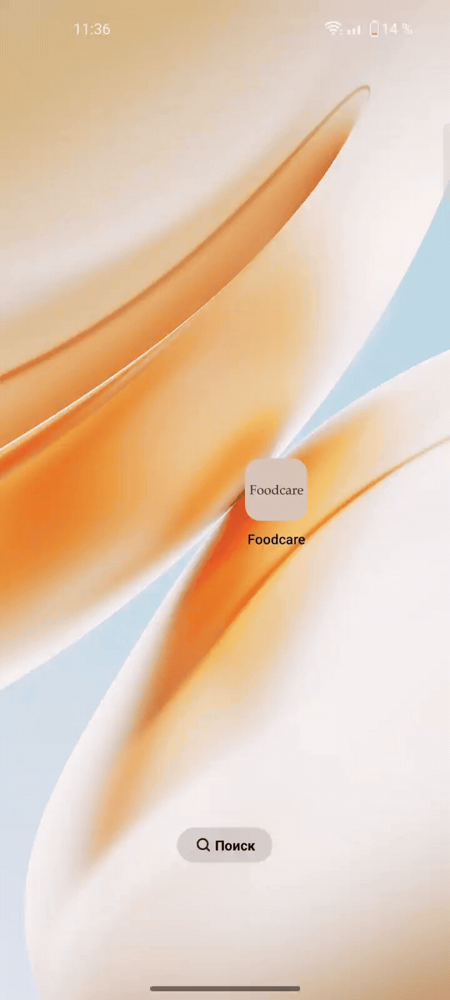
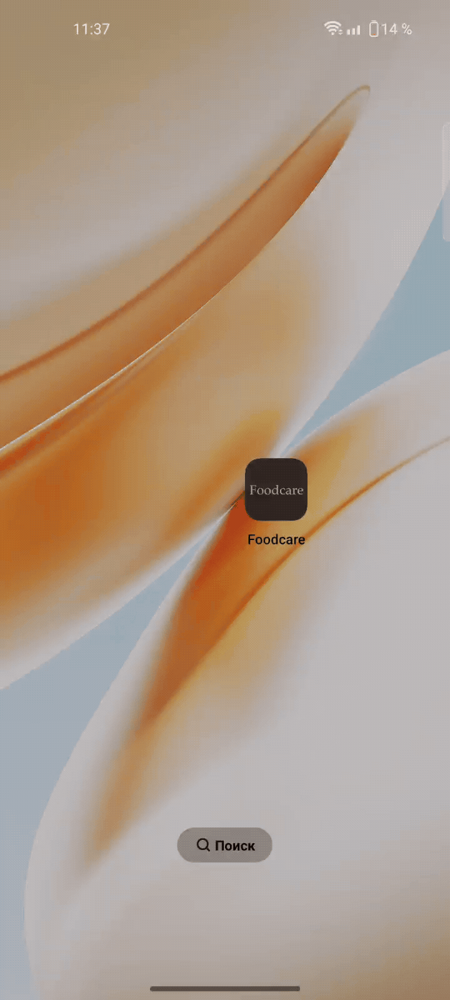
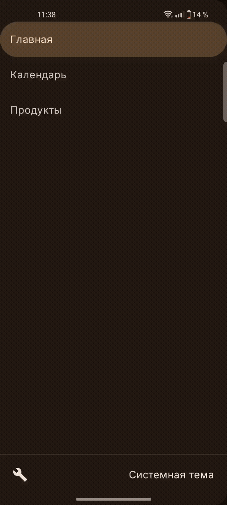
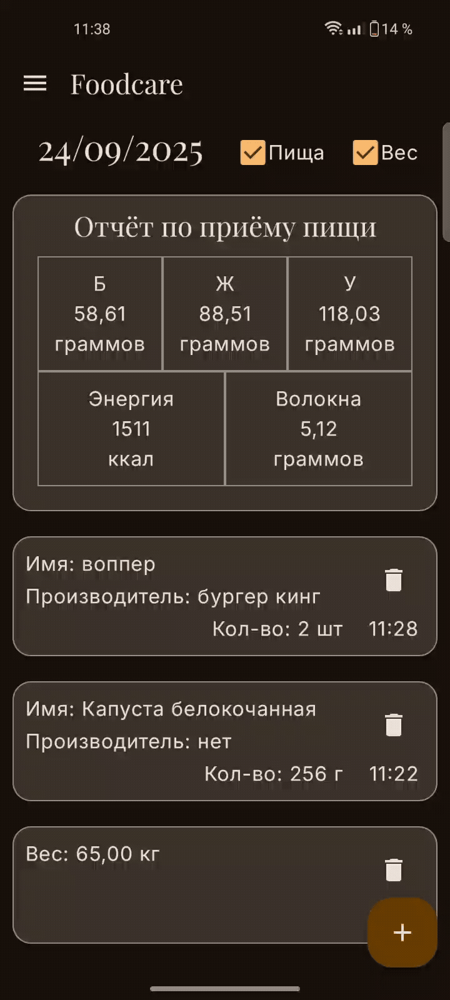
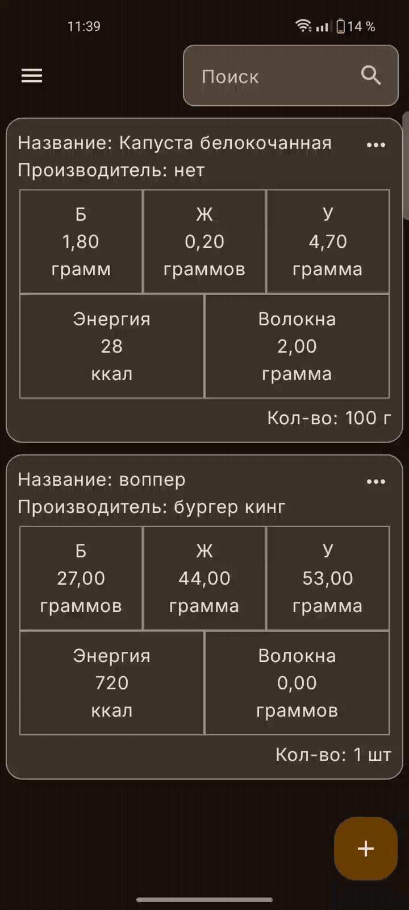
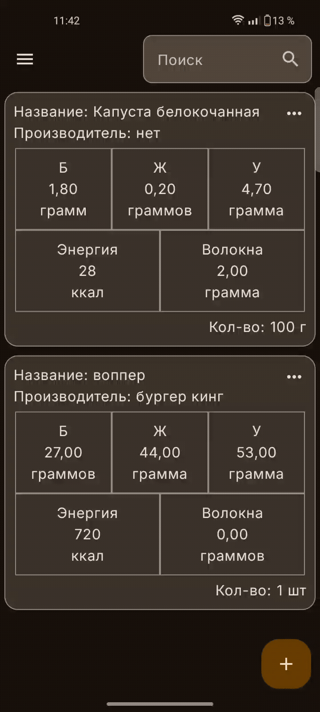
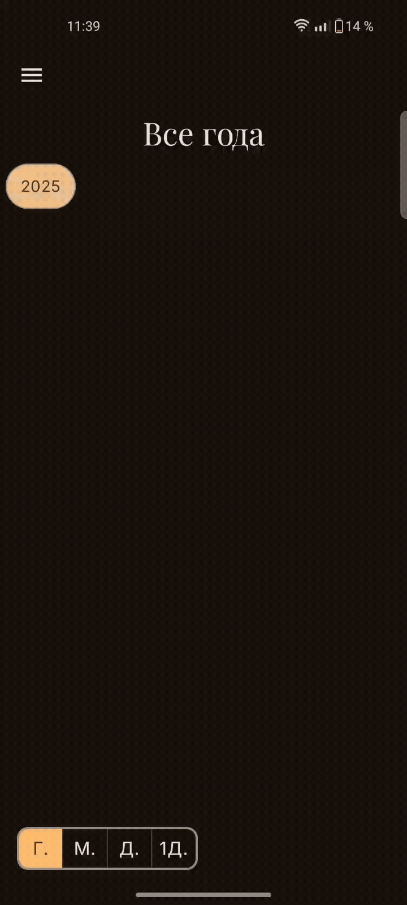
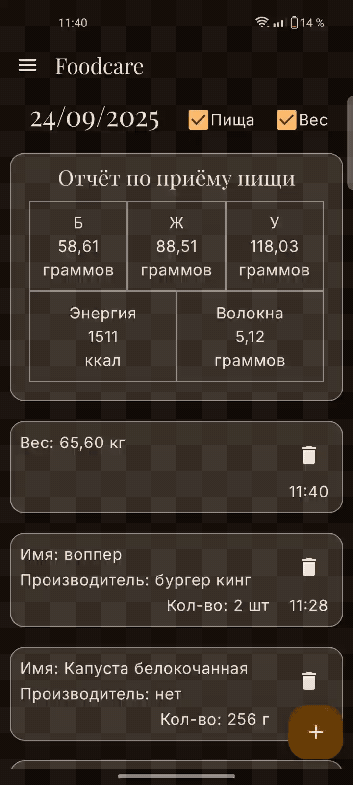
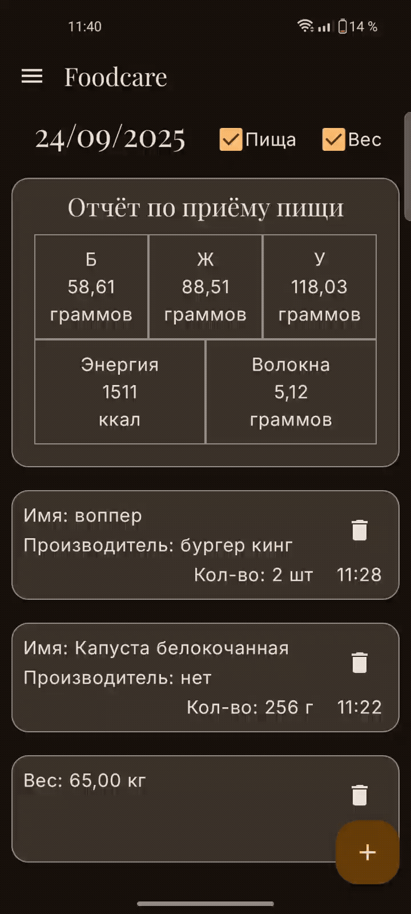

# Foodcare

Foodcare – это Android-приложение для осознанного контроля питания,
позволяющее отслеживать потребление калорий, белков, жиров, углеводов
и клетчатки, а также фиксировать изменения веса для достижения ваших целей по здоровью и форме.

## Демонстрация

| Светлая тема                   | Тёмная тема                   | Переключение                | Навигация               |
|--------------------------------|-------------------------------|-----------------------------|-------------------------|
|  |  |  |  |

| Поиск                         | Удаление             | Дата                      | Приём пищи                | Вес                         |
|-------------------------------|----------------------|---------------------------|---------------------------|-----------------------------|
|  |  |  |  |  |

## Ключевые функции

*   **Трекинг веса:** Возможность регулярно фиксировать и отслеживать изменения своего веса с просмотром истории.
*   **Персональная база продуктов:** Создание и хранение собственной базы данных часто потребляемых продуктов с указанием их калорийности, БЖУ (белков, жиров, углеводов) и содержания клетчатки.
*   **Дневник питания:** Удобная фиксация съеденной пищи в течение дня с автоматическим расчетом потребленных нутриентов на основе вашей базы продуктов.
*   **Ежедневная сводка:** Автоматическое подведение итогов по общему потреблению калорий, белков, жиров, углеводов и клетчатки за текущий день.
*   **История питания:** Просмотр подробной информации о рационе и потреблении нутриентов за любой прошедший день.
*   **Интуитивное управление данными:** Простая и понятная система для добавления новых продуктов в базу, записи приемов пищи и редактирования существующих записей.
*   **Адаптивный интерфейс:** Поддержка светлой, темной и динамической системной темы (Material You) для комфортного использования приложения в любых условиях освещения.

## Технологический стек и архитектура

*   **Язык:** Kotlin
*   **UI:** Jetpack Compose, Navigation Compose, Material3
*   **Асинхронность:** Coroutines, Flow
*   **DI:** Dagger 2
*   **Хранение данных:** Room, DataStore
*   **Архитектура:** MVVM, Clean Architecture (слои: domain, data, ui, di),
Single Activity Architecture

## Установка и запуск

1.  Клонируйте репозиторий: `git clone https://github.com/serpanti/Foodcare.git`
2.  Откройте проект в Android Studio (последняя стабильная версия).
3.  Соберите и запустите приложение.

## Планы

*   Добавить резервное копирование и импорт данных
(например, через Google Drive или локальный файл), чтобы пользователи не теряли свою историю
*   Реализовать функционал планирования индивидуальных целей потребления (калории, БЖУ),
чтобы помочь пользователям точнее следовать своему плану
*   Внедрить отображение общей статистики и трендов питания за различные периоды (неделя, месяц) для
лучшего анализа прогресса
*   Усовершенствовать пользовательский интерфейс карточек
(продукты, записи о еде, отслеживание веса) для повышения наглядности и удобства взаимодействия
*   Интегрировать поиск продуктов в интернете по названию
(например, через открытые API пищевых продуктов вроде Open Food Facts) для быстрого добавления в
персональную базу

## Лицензия

[MIT](LICENSE.md)